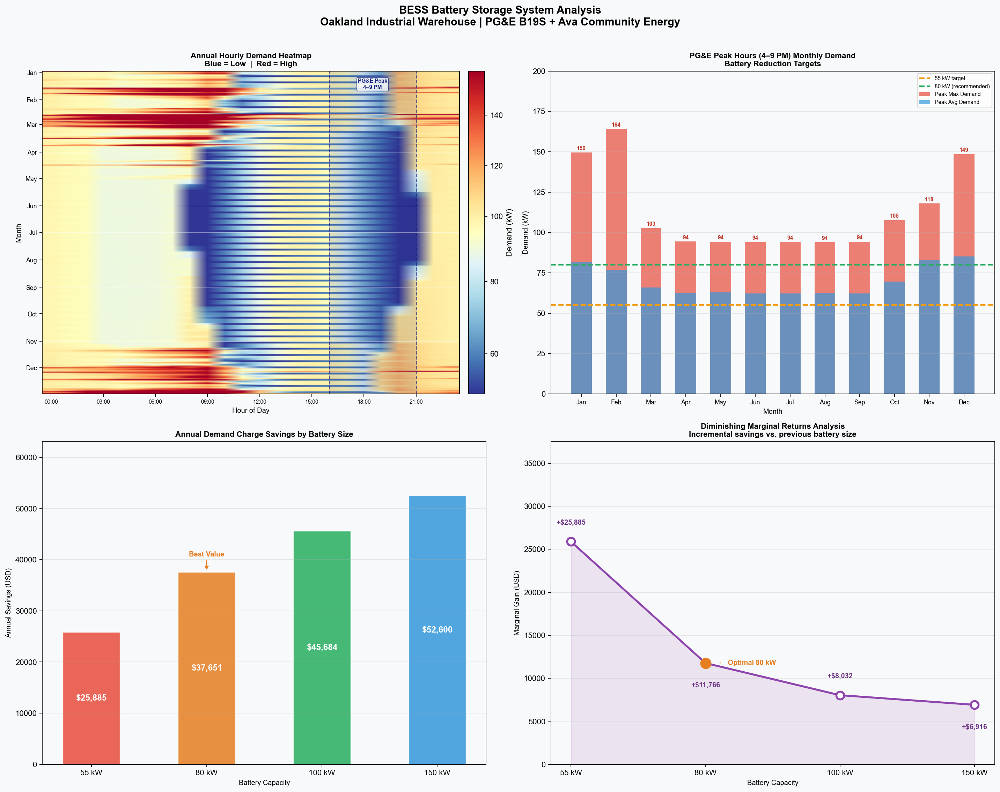
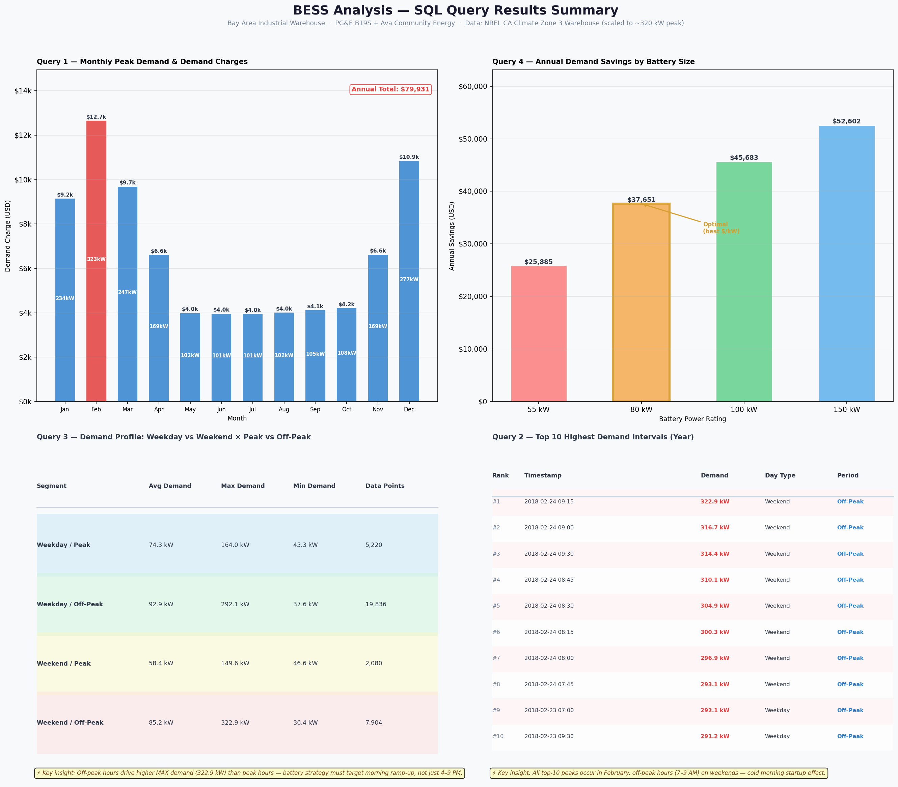

# BESS Investment Analysis — California C&I Facility

A Python-based analytical toolkit for evaluating Battery Energy Storage System (BESS) economics at a high-load commercial & industrial facility in the Bay Area, CA, operating under PG&E's B19S rate schedule with Ava Community Energy.

---

## Project Background

California C&I electricity bills can exceed **$50,000/month**, with demand charges alone accounting for 30–50% of total costs. This project models how a properly sized BESS can reduce demand charges, capture peak/off-peak arbitrage, and generate returns through demand response programs — using real bill data as the analytical foundation.

**Key financial results (base case: 400 kWh / 150 kW system):**
- Net installed cost after SGIP + ITC: ~$33,600
- Estimated monthly savings: ~$4,900
- Simple payback: ~2.3 years
- 10-year NPV (5% discount rate): ~$390k
- IRR: ~140%

---

## Repository Structure

```
bess_project/
├── src_en/                           # English source code
│   ├── module1_extract_bill.py       # PDF bill parsing & data extraction
│   ├── module2_load_prep.py          # NREL load profile scaling & cleaning
│   ├── module3_sql.py                # SQLite database queries & analysis
│   ├── module4_visualization.py      # 4-panel demand analysis chart
│   ├── module5_export_csv.py         # Export SQL results to CSV
│   ├── module6_roi_chart.py          # ROI summary visualization
│   └── module7_sql_summary.py        # SQL results summary chart
├── src_cn/                           # Chinese-annotated version (学习用)
├── data/                             # Input & processed data files
│   ├── bill_daily_data.csv           # Extracted daily usage (output of M1)
│   ├── bill_summary.csv              # Key bill figures (output of M1)
│   ├── nrel_warehouse_clean.csv      # Scaled & cleaned load profile (output of M2)
│   └── bess.db                       # SQLite database (output of M3)
├── output/
│   ├── chart_final_4in1.png          # 4-panel demand analysis (output of M4)
│   ├── monthly_demand_analysis.csv   # Monthly demand charges (output of M5)
│   ├── top10_peak_intervals.csv      # Top 10 peak intervals (output of M5)
│   ├── weekday_vs_weekend_analysis.csv # Weekday/weekend breakdown (output of M5)
│   ├── battery_savings_comparison.csv  # Battery size savings (output of M5)
│   ├── roi_summary_chart.png         # ROI summary chart (output of M6)
│   └── sql_results_summary.png       # SQL results visualization (output of M7)
├── README.md
└── README_CN.md
```

---

## Seven-Module Pipeline

### Module 1 — Bill Parsing (`module1_extract_bill.py`)
Extracts structured data from a PG&E PDF bill using `pdfplumber` and regex. Outputs daily peak/off-peak usage and key rate parameters including demand charges and blended energy rates.

### Module 2 — Load Profile Preparation (`module2_load_prep.py`)
Loads the NREL Commercial Reference Building dataset (California Climate Zone 3, warehouse type) and scales it to match the client facility's actual peak demand of ~320 kW. Flags PG&E peak hours (4–9 PM daily) and outputs a cleaned CSV ready for SQL analysis.

### Module 3 — SQL Analysis (`module3_sql.py`)
Loads cleaned data into SQLite and runs four analytical queries:
- Monthly peak demand → demand charge calculation
- Top 10 highest-demand intervals of the year
- Weekday vs. weekend × peak vs. off-peak breakdown
- Simulated demand reduction by battery size (55 / 80 / 100 kW)

### Module 4 — Visualization (`module4_visualization.py`)
Generates a 4-panel matplotlib chart:
1. Annual hourly demand heatmap (365 days × 24 hours)
2. Monthly peak demand with battery reduction target lines
3. Annual savings comparison across battery sizes
4. Marginal return analysis (diminishing returns curve)

### Module 5 — Export Results (`module5_export_csv.py`)
Exports all four SQL query results to CSV files in the output/ folder for further analysis and sharing.

### Module 6 — ROI Summary Chart (`module6_roi_chart.py`)
Generates a single-page investment summary visualization showing 10-year cash flow projection, monthly revenue breakdown by source, and incentive stack (SGIP + ITC).

### Module 7 — SQL Results Summary (`module7_sql_summary.py`)
Generates a 4-panel chart directly from the CSV outputs, combining tables and bar charts to present SQL query findings in a shareable visual format.

---

## Sample Outputs

### Demand Analysis (Module 4)


### SQL Results Summary (Module 7)


---

## Rate Structure (PG&E B19S + Ava Community Energy)

| Component | Rate |
|---|---|
| Non-coincident demand charge | $39.22 / kW·month |
| Peak demand charge (PG&E + Ava) | $3.20 + $3.20 = $6.40 / kW·month |
| Blended peak energy rate | ¢34.36 / kWh |
| Blended off-peak energy rate | ¢22.81 / kWh |
| Peak/off-peak spread (arbitrage) | ¢11.55 / kWh |

---

## Incentive Programs Modeled

| Program | Benefit |
|---|---|
| SGIP (CA Self-Generation Incentive) | $200/kWh, capped at 90% of gross cost |
| Federal ITC (IRA 2022) | 30% of net cost after SGIP |
| PG&E Option S rate | Daily demand billing, storage-friendly |
| Capacity Bidding Program (CBP) | ~$60,000/MW-yr demand response revenue |

---

## Data Sources

- **PG&E bill data**: Real utility bill (all identifying information redacted), Bay Area industrial warehouse facility
- **NREL load profile**: [Commercial Reference Buildings](https://openei.org/wiki/Commercial_Reference_Buildings) — California Climate Zone 3, warehouse, 8,760-hour annual dataset

> **Note:** `up00-ca-warehouse.csv` is not included in this repo due to file size. Download directly from [OpenEI Commercial Reference Buildings](https://openei.org/wiki/Commercial_Reference_Buildings), select California Climate Zone 3, warehouse type. Place the file in the `data/` folder before running Module 2.

---

## Tech Stack

```
Python 3.14    pdfplumber    pandas    sqlite3
matplotlib     numpy         re
```

---

## How to Run

```bash
# Install dependencies
pip install pdfplumber pandas matplotlib numpy

# Run modules in order
cd src_en
python module1_extract_bill.py   # outputs to ../data/
python module2_load_prep.py      # outputs to ../data/
python module3_sql.py            # outputs to ../data/bess.db
python module4_visualization.py  # outputs to ../output/
python module5_export_csv.py     # outputs to ../output/
python module6_roi_chart.py      # outputs to ../output/
python module7_sql_summary.py    # outputs to ../output/
```

---

## About

Built as a self-directed learning project at the intersection of energy investment analysis and data engineering. The goal: use a real California C&I client case as the hands-on substrate for learning Python, SQL, and data visualization — while producing work product directly applicable to BESS investment decisions.

**Author:** Simen Zhu
**LinkedIn:** [linkedin.com/in/simen-zhu](https://linkedin.com/in/simen-zhu)
**GitHub:** [github.com/HappyPigSummer](https://github.com/HappyPigSummer)
